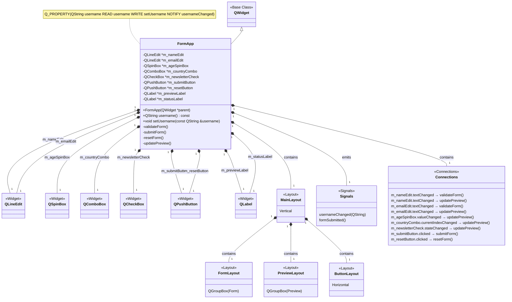

Here's a diagram that explains the structure of the Form Application example. Let me explain the key elements:

1. **Class Hierarchy**:
   - The `FormApp` class inherits from the Qt base class `QWidget`
   - It contains various Qt widget member variables (QLineEdit, QSpinBox, etc.)

2. **Widget Composition**:
   - The diagram shows how `FormApp` contains different Qt widgets as member variables
   - Each widget has a specific purpose in the form (input, display, or control)

3. **Layout Structure**:
   - The application uses a hierarchical layout system
   - `MainLayout` (vertical) contains the form layout, preview layout, and button layout
   - Each specialized layout organizes a specific part of the UI

4. **Signal/Slot Connections**:
   - The bottom section shows the signal flow
   - Widget signals (like `textChanged`, `clicked`) are connected to slots in the `FormApp` class
   - For example, when text changes in the name edit, both `validateForm()` and `updatePreview()` are called

5. **Property System**:
   - The form has a `username` property with getter/setter methods and a notification signal
   - This demonstrates Qt's property system integration

This diagram helps visualize how the different pieces of the application work together, particularly:
- How widgets are organized in the UI
- How data flows through the application via signals and slots
- How the layout hierarchy structures the visual presentation

The architecture follows Qt's best practices by:
- Separating UI elements (widgets) from business logic
- Using signals/slots for loose coupling between components
- Organizing the UI with appropriate layouts
- Implementing the property system for data binding
